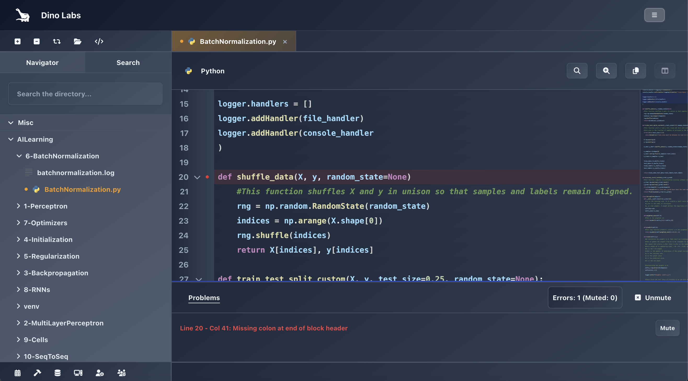
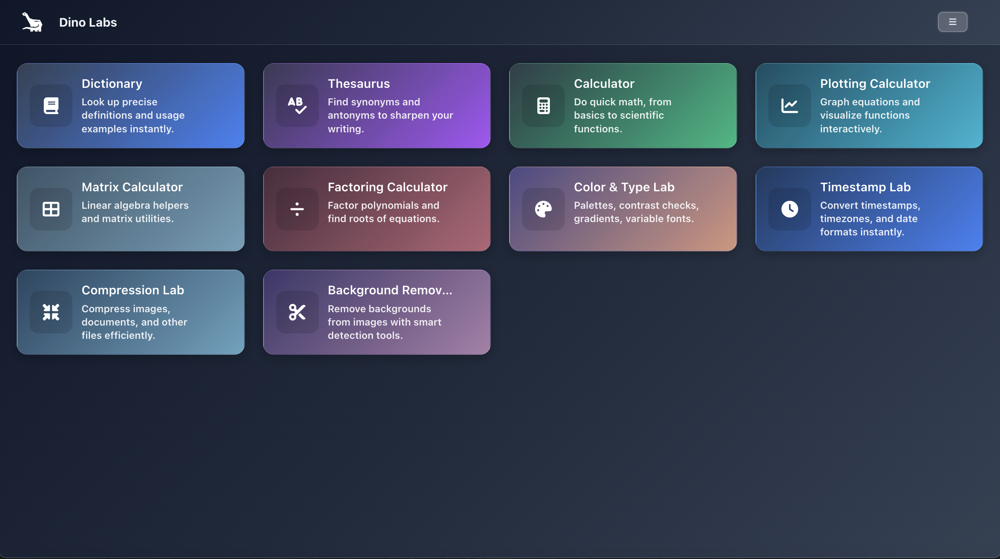
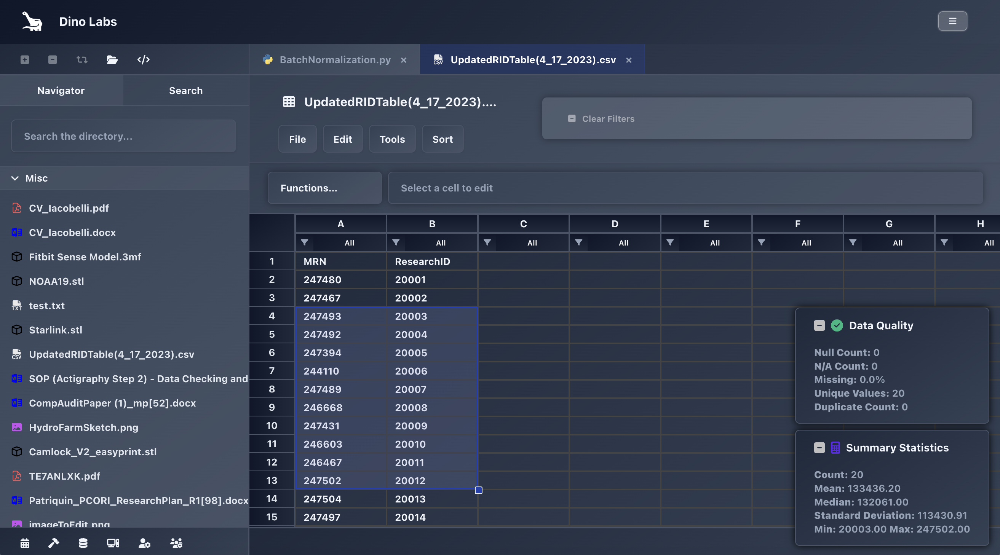
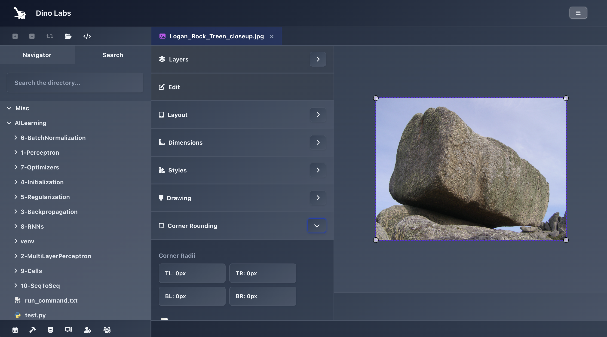
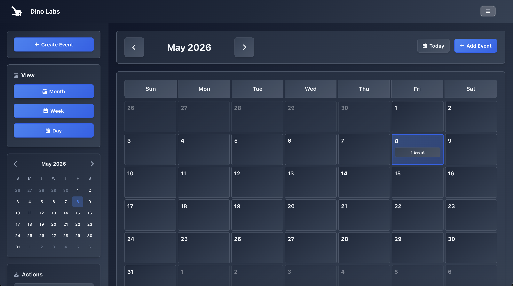
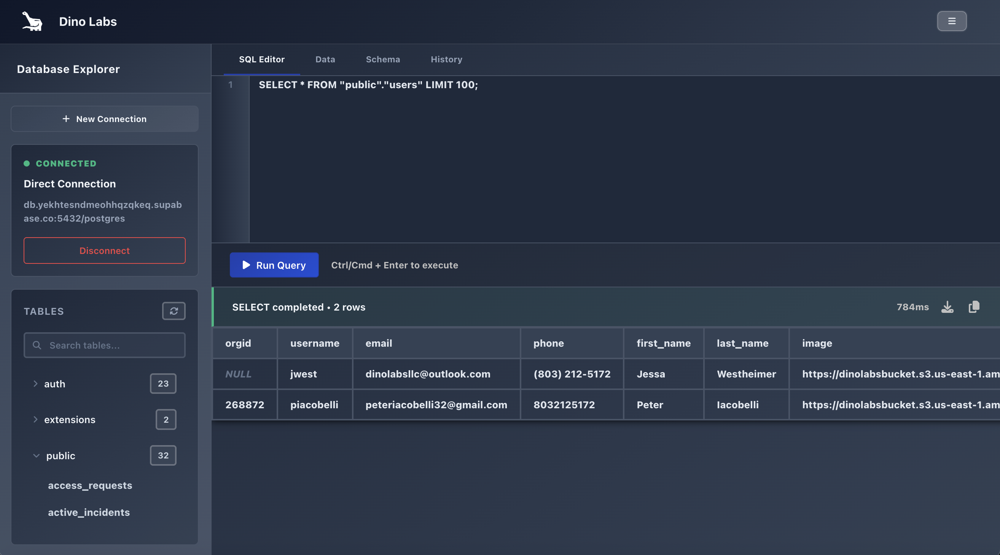

# DinoLabs

Dino Labs is built to be a free, browser-based creative studio that anyone can access. It's a single web app that pulls together file editors, productivity utilities, and developer tooling that would normally be spread across a dozen separate desktop apps. With this platform you get all of them running client-side in one unified workstation.

While this app is self-hosted, free to use, and bears all on this GitHub, it is worth noting that it is a for-fun project. I'm just a guy. I'm not a company. This is not my full time job. I'm not a frontend engineer. Permissions, usage rights, etc. are all subject to change if hosting becomes too much. I am planning to continue to improve all of the editors, continue improving all of the existing tools, and add new tools. The rate at which I do that is also likely going to be pretty variable. Feedback is always welcome.  

This is a frontend product. The backend is kept intentionally small. This is mostly because this is a frontend learning project for me. How can I make some really cool editors and tools entirely (almost) on the frontend while using minimal existing libraries, packages, etc? That is the question that sparked this project. Calendar CRUD and a PostgreSQL connection proxy are the only two route groups, plus the Dino Auth pass-through for everything user/team-related. Most "creative studio" platforms in this category are thin clients on top of a heavy server. DinoLabs is the inverse.

Hosted at **[DinoLabs](https://dino-labs.vercel.app/login)**. Account creation, sessions, and team management are handled through Dino Auth (see below).

**Stack:** React + Vite on the frontend, Node.js + Express + PostgreSQL on the backend. File System Access API + IndexedDB for persistence.

---

## Screenshots

| Code Editor | Plugins Hub | Tabular Editor |
|:---:|:---:|:---:|
|  |  |  |

| Image Editor | Calendar | Database Explorer |
|:---:|:---:|:---:|
|  |  |  |

---

## The pages

DinoLabs groups its pages into three categories: **Workstation** (account, productivity, and diagnostics surfaces), **Editors** (the seven file-type editors plus the PDF viewer), and **Toolkit** (the ten plugin utilities organized into Math/Computation, Design/Media, and Reference/Utility).

### Workstation

#### Calendar
The calendar includes month, week, and day views, with 64-pixel-per-hour time slots and support for events that continue across multiple days. Each day that is touched by a multi-day event gets its own block, with the start and end of the event clamped to midnight on any days that are entirely covered by the event. Block geometry runs through `getEventPosition`, which classifies each render against `isStartDay`, `isEndDay`, and `isMiddleDay` and produces top/height in pixels.

I built a custom `CustomDateTimePicker` component with an embedded mini-calendar that uses month navigation, a grid for days, and three different selects for 12-hour hour, minutes, and AM/PM. All of this is driven by regex-parsing of a displayed timezone-formatted date string so that the picker can remain consistent with the `userTimezone`.

I took a layered approach to timezone handling: with `"America/New_York"` being the default. The first fetch to the backend checks for a stored preferred timezone in the user's table entry with the `/user-info` endpoint. If the field is not set or there is a failure, timezone is determined from the browser using `Intl.DateTimeFormat().resolvedOptions().timeZone`. Display strings (event time labels, formatted dates) all run through `formatTimeInTimezone`/`formatDate` which respect userTimezone. 

A CRUD approach to event management is layered on and utilizes the `/calendar-events` endpoint. Seven color-coded event types live in the `eventTypes` table: event, meeting, reminder, deadline, personal, review, presentation. Seven reminder options: At Time Of Event, 5min, 15min, 30min, 1h, 1d, 1w before.

A long-event guard prompts a confirmation dialog when an event spans for more than 7 days, which asks the user to confirm before saving. Simple JSON export is implemented here, which simply writes the current event array (with all of the parsed Date objects) to a downloaded file using a Blob URL. Clicking outside the event modal dismisses it, with an intentional exception for the alert-dialog overlay, so confirmations don't accidentally close the modal underneath them.

#### Database
This is a full PostgreSQL client running in the browser. Connection management supports both parameter-based config (host, port, database, user, password, SSL mode) and connection-URL parsing (a `^postgres(?:ql)?://([^:]+):([^@]+)@([^:/]+):?(\d+)?/(.+)$` regex extracts the components). I've integrated save, load, delete and test operations for the management of database connections. There are two execution paths: saved connections, which are keyed by `connectionID` against the credential store in the backend, and the direct connections path, where the connection parameters are kept only shortly on the client as `connectionConfig` and sent fresh with each new request. The `getConnectionPayload()` helper switches between these two options for downstream calls. 

I've implemented a schema browser that groups tables by the schema name and added search filtering by the `name` and `schema` fields. The `expandedSchemas` map defaults public to expanded and other schemas to collapsed. When you click on any of the tables, a tabbed detail view with a schema-panel (columns, types, constraints, and indices) opens, as well as a paginated sortable data viewer and table-level stats (row count, table size, index size, total size). 

The query editor is a custom-built component with line numbers, PL/pgSQL block-aware code folding, tab indent handling, and Ctrl/Cmd+Enter execution. Folding recognizes a broad set of block openers: `BEGIN`, `CASE`, `CREATE FUNCTION/PROCEDURE/TRIGGER`, `DO`, `LOOP`, and `IF...THEN`, paired with `END`, `END CASE`, `END IF`, `END LOOP`, and `$$;?` as closers. All of these openers and closers are matched via regex against per-line text. Folds in this editor are not built to survive typing, character edits will open them. Click to toggle on the gutter chevron expands or collapses individual folded blocks. 

Query results render with timing of the actual execution, which is computed client-side from `Date.now()` deltas around the fetch. CSV export is supported with JSON-stringified cells for safe quoting, as well as JSON copy-to-clipboard and a 50-entry rolling, in-memory query history. This history is not sustained and will wipe on page reload. The SQL editor currently supports basic DDL statements: `CREATE`, `DROP`, `ALTER`, etc. These statements trigger updates to the schema so when tables are created or dropped, those changes will be reflected in the listed schemas without need for a refresh that would otherwise wipe the query history. 

#### Monitoring
This is a client-side, minimal diagnostics dashboard whose information is entirely sourced from the available browser APIs, no server involvement on this page. 

### Editors

All of the editors available within the platform run on the client side, with the only backend call being to track file saves and usage within the platform. Files are loaded with the File System Access API when it is available, with built-in fallback to traditional file input. It uses IndexedDB for the working buffer. The saved state of active files survives page reloads using the IndexedDB layer. 

#### Code Editor
This is a custom code editor built in a few separate components, primarily `DinoLabsMirror`, a custom component built in lieu of Monaco or CodeMirror. The architecture for the code editor involves a dual layer textarea-over-pre approach. The textarea handles all of the input and selection while a synchronized `<pre>` element underneath is used to render the highlighted token tree, so caret behavior matches native browser controls and copy/paste can survive. 

Currently, custom-built and highly tuned regex tokenization in `DinoLabsParser.jsx` covers 19 different grammars across 24 different language identifiers. These currently include Python, TypeScript, JavaScript (with shared dialects for React, Node, and Express), C, C++, C#, Rust, Swift, PHP, SQL, Bash/Shell, Monkey C, Assembly (x86/x64 with full register and directive coverage), JSON, CSS, HTML, XML, Dockerfile, and Makefile. Language support is time consuming and I plan to add more support for other languages later on. Each of these grammars is given its own keyword set, operator table, string/comment rules and when applicable a builtin/type/decorator layer (Python magic methods, TypeScript JSX tags, C# System namespaces, PHP superglobals, Rust lifetimes, x86 register classes, etc.). Per-grammar pattern arrays are paired with a parallel `tokenTypes` map, which assigns semantic CSS classes (keyword, function, type, decorator, comment, regex lifetime, superglobal, etc.) each of which can capture the group so that themes can target individual token classes independently. 

The tokenizer is built using a four layer caching system. A compiled-regex map holds at most 200 fully-compiled per-language regex objects. All of these per-language patterns are joined into one alternation with the global+case-insensitive flags so that a single `regex.exec` walk can produce every single token in a line. A line-level token cache is kept as well, which keys by `language-lineNumber-fastHash(content)` and holds up to 2000 tokenized lines, where `fastHash` is an inline 32-bit string hash which avoids the cost of building the cache key from full string content. I also keep a full-document token cache which is used to hold up to 1000 entries keyed by `language-fastHash(fullSource)` so re-tokenizing an unchanged file is O(1). Lastly, a highlight cache is maintained to hold up to 1500 fully-rendered HTML strings keyed by content hash plus search term, case sensitivity, and theme so that a re-render with the same search query and unchanged content can reuse the cached HTML. All four of these caches use FIFO eviction when their size limits are reached. 

There are two different entry points for tokenization: `tokenize` walks the entire document and it is used for any full-file operations like global search and exporting, `tokenizeViewport` uses a `[startLine, endLine]` range to tokenize only that window. The latter is what the editor itself uses to tokenize the editable content, so that I can bound the frame budget regardless of the file size. I use a helper function called `getVisibleLineRange` to compute the size of the visible window and the text within that range with a buffer above and below to ensure syntax highlighting appears on fast scrolling. Search and highlight functionality within the editor only highlights lines within the visible window, is responsive to scrolling, and falls back to plain escaped text outside it. 

Search highlighting is range aware down to the character level. If a search query comes up with a match that spans over multiple tokens or partially overlaps with a single token, the highlighting function will split the HTML of the impacted token so that the applied highlighter span can wrap around only the matched substring while the surroundings are unaffected and retain their syntax highlighting.

Per-language linting scripts exist in the `DinoLabsLint/` subdirectory. Each one of these scripts uses an exported function and a custom set of parameters to flag language-specific issues in the script, which surface as an indicator mark and line highlight in the editor. 

Code folding tracks several different things including brace pairs, indent levels, and language-specific block markers to determine the starting and ending points of block folds. Markers such as breakpoints in the gutter are persisted across page reloads. The custom-built minimap renders a downscaled token-color map of the document with click-to-jump navigation. Context menu commands such as undo, redo, copy, paste, etc. are fed into a command queue with grouped operations (including typing) so that operations like undo or redo affect the last operation, not the last keystroke.

The grammar list above reflects current state. Additional language support (Go, Java, Kotlin, Ruby, YAML, Markdown grammar, SCSS, GraphQL, and others) and the associated linting scripts are planned and will land incrementally.

#### Audio Editor
This is a DAW-lite style browser-based audio editor built on the Web Audio API. The signal chain used here routes source through a mixer node into a 3-band parametric EQ (lowshelf at 200 Hz, peaking at 1 kHz with configurable Q, highshelf at 3 kHz). The chain then splits so that there is a vocal path running parallel. The first of the two paths makes use of a band-stop notch at 1200 Hz used to suppress vocals complemented by the second of the two paths which uses a bandpass at 1200 Hz with a separate gain node used to isolate and boost vocals, with the Q factor controlling the sharpness of the isolation. Both of these paths merge to create a new pre-effect mux, which feeds into three parallel destinations: the dry signal, an echo path (delay node at 0.3s with a feedback loop through a gain node), and a reverb path (ConvolverNode against a procedurally-generated impulse response built from exponentially-decaying random noise). The three paths merge into a final mix, through a stereo panner, through an ADSR envelope gain node (attack/decay/sustain/release with exponentialRampToValueAtTime scheduling), through a master gain, through an AnalyserNode, and out to the destination.

Seven live visualizations plus a static ADSR curve render. The live ones run on `requestAnimationFrame` loops attached to AnalyserNodes at different points in the chain: waveform (block-averaged amplitude with gradient fill and playhead), frequency bars (FFT magnitude with frequency-axis labels derived from sample rate and bin size), scrolling spectrogram (column-at-a-time with three-tier magnitude coloring), oscilloscope (time-domain byte data), left and right channel VU meters (RMS-computed bar meters from a ChannelSplitter), and a phase scope (Lissajous-style L vs R plot). The static canvas renders the ADSR envelope curve from the current attack/decay/sustain/release parameters.

Pitch shift is implemented via playback rate manipulation (`Math.pow(2, pitchShift / 12)` applied to each BufferSource's `playbackRate`), which changes both pitch and duration simultaneously. Fade in/out apply linear gain ramps at the start and end of the buffer during offline rendering.

The timeline that I've implemented can auto-assign clips to tracks so clips that overlap in time get placed on separate track lanes automatically. All of the clips support drag-to-reorder, splitting on double-click (at the playhead position), deletion, duplication, left/right edge trimming to resize the start time or duration by dragging. 

OfflineAudioContext-based merge rebuilds the entire signal chain (EQ, vocal isolation, echo, reverb, panner, ADSR envelope, fade in/out) in an offline context, renders to a buffer, and replaces the track list with the merged result. WAV encoder writes 16-bit PCM with correct RIFF/WAVE headers (format chunk, data chunk, interleaved channel samples). Export offers .wav, .mp3, and .flac format options (all currently encode as WAV regardless of selection).

#### Image Editor
This editor is a multi-layer compositor that supports PNG, JPEG, WebP, and SVG inputs. There are three different layer types that I support. The base layer is the loaded image that is always present and everything sits on top of it. The image layers are imported raster images that can be stacked on top of the base layer and are individually editable. Drawing layers are created via my drawing or highlighting tool. 

Multi-select with Ctrl/Cmd+click works across all layer types, and the sidebar's Layout/Styles/Drawing controls apply to whichever layers are currently selected. Each layer has visibility toggle, lock (prevents interaction), rename, reorder (move up/down in the stack), and delete. Image layers can be imported via a file picker or by dragging and dropping image files onto the canvas, and each one gets its own corner-handle resize interaction.

Drawing in the editor uses SVG coordinate math via the `createSVGPoint` function and `getScreenCTM().inverse()` to convert your mouse positions seamlessly into the viewBox coordinate space. It then constructs quadratic Bézier curves in between sample points to smooth the strokes. Each of the completed strokes becomes a new drawing layer with its own color, stroke width, and full per-layer property set including the rotation, zoom, flip, opacity, hue, saturation, brightness, contrast, blur, grayscale, sepia tweakability. A separate highlight mode uses the same drawing pipeline with semi-transparent colors, to create a highlighter effect, rather than an opaque drawing. 

I've implemented a cropping tool that uses canvas-based re-rasterization. An offscreen canvas can composite the base image (with its complete CSS filter chain applied via `ctx.filter`) plus all of the visible layers stacked on top of it (with the per-layer transforms and filters kept intact), then can extract the crop rectangle as a new data URL that can replace the base image. The crop state is maintained in a history stack just like all of the drawing, highlighting, filtering, and transforms. The cropping tool is rectangular by default, draggable, and rotatable. Circle crop is also supported. Crop is disabled when the base layer is rotated or flipped, which would cause incorrect cropping results. 

The entirety of the per-layer CSS-filter chain is rendered through the canvas filter property on export to produce a single composite output. The export pipeline supports scale multipliers, format selection (PNG, JPEG, WebP, and SVG), and per-layer or all-layer output.  

#### Video Editor
This editor features the same CSS filter chain transform/filter/crop/corner-rounding architecture as the image editor, but is extended by adding timeline, text-overlay, frame-extraction, and capture features. The crop functionality utilizes `canvas.captureStream() + MediaRecorder` to re-encode: each one of the frames is drawn using the `requestAnimationFrame` function from the source video through the cropping rectangle with the full CSS filter chain (hue, saturation, brightness, contrast, blur, grayscale, sepia, opacity) all of which is applied via the `ctx.filter` layer, which creates a new WebM blob URL that can replace the source. Circle crop is also supported here and works the same way. Cropping is also disabled here when the base layer is rotated or flipped. Crop history is once again maintained, allowing for undo and redo. 

Text overlays are ranged by time. Each of the overlays has a `startTime` and `duration` parameter and renders only when the playhead is within that range. The overlays are just dividers positioned on the video canvas over their designated time ranges, so they can have configurable font, size, color, alignment, bold/italic/underline, opacity, and text shadow. The click-to-place mode lets you click anywhere on the video to position a new overlay at that point. If you select an overlay, it will show a dashed selection border letting you know that it is editable. 

The frame extraction feature can pull up to 100 frames at selectable intervals. It can do this by finding the video segment at each target time and drawing a 160x90 thumbnail canvas, then placing those thumbnails on an ordered, scrollable track with timestamps. Clicking a frame seeks the video to that timestamp. The frames can be drag reordered which will be reflected in the video by making edits to the canvas using `captureStream + MediaRecorder` at 15 fps, and tracked in the history. 

Export dialog offers format (MP4, MOV, WebM, AVI), quality (480p to 4K), and resolution (original, 720p, 1080p, 4K) selection.

#### PDF Editor
Currently, this is essentially just a renderer that pulls a PDF into an iFrame blob URL with the native browser PDF viewer. I parameterize it with `#page=1&zoom=page-width&view=FitH&navpanes=0` to suppress the navigation panes and fit it horizontally. Currently, it is intentionally minimal. 

#### 3D Viewer
This editor includes a magic-byte and header-text format detector to dispatch to four different format-specific object parsers. The STL parser can handle both ASCII and binary, and features normalized per-triangle extraction with a fallback to computed vertex normals when the normals from the source are zero. The OBJ parser can handle material slot parsing, per-vertex normals when they are available from the source, and fan triangulation of n-gonal faces. The PLY parser can also handle both ASCII and binary in little- and big-endian flavors, and includes header property parsing that fuels a type-dispatched scalar reader for different types. The OFF parser can handle the simpler vertex-then-face format from the Princeton Shape Benchmark. The editor supports GLTF, GLB, DAE, X3D, and 3MF at the magic-byte level however currently those types render as icosahedron placeholders, as the full parsers have not been built yet. The format detection runs against the first 8 KB of the file and includes additional structural checks. 

The editor currently uses a Three.js scene with manual controls for the viewing. These manual controls include orbit, panning, zooming, and they are implemented from scratch. Spherical orbit math uses phi clamping at the poles, the screen-space panning uses camera matrix columns, and the zooming uses a distance-clamped wheel. The grid is designed to auto-scale with the distance of the camera so that it can be visually appropriate at extreme ranges. Initially loaded models are auto-scaled to fit a 40 unit target and auto-centered. Normals for the loaded object are computed if the source doesn't include them. I've implemented click-to-highlight raycasting to toggle the material color of the model, as well as a custom built directional pad with unit scaling/normalization. 

#### Tabular Editor
This is a spreadsheet editor with a real, custom formula engine. The engine works by tokenizing formula strings (numbers, A1-style cell references, : range references, function names, and operators), then runs Shunting-yard to convert to RPN, and then uses cycle detection to evaluate them: a `visiting` set tracks cells that are currently on the evaluation stack and any re-entry returns `#CYCLE!`, with an additional memoizing cache that is reused across the full table compute pass on every edit. Currently I support about 35 built-in functions covering basic arithmetic, operators, logic, date, and aggregation. 

Cell editing in the spreadsheet supports formula-bar cell-picking. If you position the cursor inside of the argument slot of a function call (detected by counting the unbalanced parentheses in the prefix), when you click on or drag across a range, it will insert the matching reference text into that single cell or all the cells in the dragged over range, replacing what was previously there. The header-click multi-select extends this functionality so when you click a column header it will insert a column-spanning range, and clicking a row number will insert a row-spanning range. When you are editing a cell, the referenced cells of the current active formula get a colored overlay so you can easily tell which cells the formula is dependent on, and a separate semi-transparent overlay denotes the range that is being actively picked. 

The grid is rendered through react-window's VariableSizeGrid, which is great for keeping the scrolling at a smooth frame rate even for sheets that have 100k+ cells. Both the rows and the columns will auto-grow as you scroll. The visible window minimums I currently have (`minNeededRows`, `minNeededCols`) are derived from the dimensions of the container divided by the default cell size, plus a buffer, and new rows and columns are mounted on in chunks of up to 10k at a time, whenever the scroll position passes the max boundary.

Each of the column headers has an "All" or "N selected" trigger button for filtering of that column, which opens a custom dropdown that has per-value checkboxes with search so you can filter for specific values in the column. Active filters tint the column header purple and reduce the visible row set by intersecting all of the active per-column filters. The keyboard navigation is selection-aware and will skip rows that you have filtered out.

The custom-built selection system supports multi-cell and full-row/full-column modes. You can drag-to-move the selection block to set a new origin (with a dialog for when you drag over existing data), Shift+Click to extend, and selection block resizing to grab more or less data. The copy/cut/paste commands will also trigger a confirmation dialog when data is being removed or replaced. Basic column sorting supports 0-9, 9-0, A-Z, and Z-A filtering on the selection range, with empty cells sorting to the end.

The formula bar implemented at the top of the spreadsheet will mirror the active cell's editing buffer with bidirectional sync, and also includes a function picker dropdown that will allow you to pick a preset function. A per-cell ring buffer is used to track the history of that cell, allowing for undo/redo within individual active cells, separate from the cross-cell history stack that controls undo/redo when no individual cell is currently active.

#### Rich Text Editor
This editor is built to support .txt and .md files. It includes standard text editor functionality including undo/redo, copy/paste/cut, and file saving. The editor also features a special characters dropdown picker that covers four different categories with specific symbols acceptable in the given file type: math operators and relations, Latin characters, Greek characters, and punctuation.

### Toolkit

#### Toolkit Hub
This is the launcher for the toolkit pages. It renders as a grid that is grouped by categories: math/computation, design/media, reference/utility. Each of the tiles in this grid contains the tool name and a brief description with an icon for easy selection and navigation to that built-in tool. It has built-in search to quickly filter the available tools. It features a set of experimental tools that are all still under development. 

#### Math / Computation

- Calculator
- Factoring Calculator
- Matrix Calculator
- Plotting Calculator

#### Design / Media

- Background Remover
- Color Type Lab
- Compression Lab

#### Reference / Utility

- Dictionary
- Thesaurus
- Timestamp Lab

---

## Architecture

DinoLabs is a two-repo project: a React frontend (`dinolabsweb/`) and a Node.js/Express backend (`dinolabs_webapi/`). The backend serves only the calendar CRUD routes, the database connection proxy, and the Dino Auth integration. The frontend handles all rendering, file I/O, editing, and computation.

### Frontend (`dinolabsweb/`)

```
dinolabsweb/
├── public/
│   ├── language-images/         Per-language icon set for the Code Editor
│   ├── ref-images/              Reference imagery
│   ├── ref-logos/               Brand assets
│   ├── DinoLabsLogo*.png
│   └── SolarSystemBackground.mp4
├── src/
│   ├── pages/
│   │   ├── Authentication/
│   │   │   ├── AuthLogin.jsx
│   │   │   ├── AuthRegister.jsx
│   │   │   ├── AuthReset.jsx
│   │   │   └── AuthVerifyEmail.jsx
│   │   ├── DinoLabsAccount/
│   │   │   ├── DinoLabsAccount.jsx
│   │   │   ├── DinoLabsCalendar.jsx
│   │   │   ├── DinoLabsDatabase.jsx
│   │   │   ├── DinoLabsMonitoring.jsx
│   │   │   └── DinoLabsTeam.jsx
│   │   ├── DinoLabsCode/
│   │   │   ├── DinoLabsLint/    Per-language linting scripts
│   │   │   ├── DinoLabsMarkdown.jsx
│   │   │   ├── DinoLabsMirror.jsx
│   │   │   └── DinoLabsParser.jsx
│   │   ├── DinoLabsMedia/
│   │   │   ├── DinoLabsAudioEditor/
│   │   │   ├── DinoLabsImageEditor/
│   │   │   ├── DinoLabsPDFEditor/
│   │   │   ├── DinoLabsThreeDEditor/
│   │   │   └── DinoLabsVideoEditor/
│   │   ├── DinoLabsPlugins/
│   │   │   ├── DinoLabsPluginsBackgroundRemover/
│   │   │   ├── DinoLabsPluginsCalculator/
│   │   │   ├── DinoLabsPluginsColorTypeLab/
│   │   │   ├── DinoLabsPluginsCompressionLab/
│   │   │   ├── DinoLabsPluginsDictionary/
│   │   │   ├── DinoLabsPluginsFactoring/
│   │   │   ├── DinoLabsPluginsMatrix/
│   │   │   ├── DinoLabsPluginsPlot/
│   │   │   ├── DinoLabsPluginsThesaurus/
│   │   │   ├── DinoLabsPluginsTimestampLab/
│   │   │   └── DinoLabsPlugins.jsx     Plugins Hub launcher
│   │   ├── DinoLabsTabular/
│   │   │   └── DinoLabsTabularEditor.jsx
│   │   ├── DinoLabsText/
│   │   │   └── DinoLabsRichTextEditor.jsx
│   │   ├── DinoLabs.jsx                Workspace shell
│   │   ├── DinoLabsFileTypeMap.jsx     File extension to editor routing
│   │   └── DinoLabsNoFileSelected.jsx
│   ├── helpers/
│   │   ├── PlottingHelpers/
│   │   │   ├── DoughnutHelper.jsx
│   │   │   └── LineHelper.jsx
│   │   ├── Alert.jsx
│   │   ├── ColorPicker.jsx
│   │   ├── Loading.jsx
│   │   ├── Mobile.jsx
│   │   ├── Nav.jsx
│   │   └── Unavailable.jsx
│   ├── styles/
│   │   ├── helperStyles/        Shared component styles
│   │   └── mainStyles/          Per-page styles, plus MirrorThemes for code editor
│   ├── App.jsx
│   ├── ErrorBoundary.jsx
│   ├── ProtectedRoute.jsx       Token gate, redirects to Dino Auth
│   ├── TouchDevice.jsx          Mobile-block screen
│   └── UseAuth.jsx              Dino Auth hook
├── Dockerfile
├── eslint.config.js
├── vite.config.js
└── vercel.json
```

### Backend (`dinolabs_webapi/`)

```
dinolabs_webapi/
├── api/
│   ├── config/
│   │   ├── db.js                PostgreSQL pool
│   │   ├── s3.js                Object storage client
│   │   └── smtp.js              Transactional mail
│   ├── middleware/
│   │   ├── auth.js              Dino Auth token validation
│   │   ├── errorLogger.js
│   │   └── rateLimiter.js
│   ├── routes/
│   │   └── dinolabs-playground/
│   │       ├── dinolabs-playground-calendar.js
│   │       └── dinolabs-playground-database.js
│   ├── workers/
│   │   └── connectionManager.js  Per-user PostgreSQL connection pool
│   ├── public/                   Catchall and static
│   ├── docs/
│   └── index.js
└── vercel.json
```

The backend routes are intentionally designed to be minimal. Calendar handles event CRUD. Database handles connection management including saving, loading, deleting, and testing connections, plus query execution proxying and secure encrypted credential storage using AES-256-CBC. Everything else including auth, profile, and team routes through Dino Auth as a pass-through.

### Persistence
- File System Access API. Modern Chromium browsers get direct file handles, so opening a file once gives the editor read/write access to it on subsequent sessions without re-prompting. Edits save back to the original file on disk.
- IndexedDB. The fallback persistence layer for browsers without File System Access API support, and the working-buffer store for unsaved changes regardless of browser. Survives reloads.
- Session State. Things like open files and save state are preserved in IndexedDB so they can survive page refreshes.
- PostgreSQL. Used for storing your calendar events and database access credentials. Otherwise only used for saving minimal usage metrics.

### Three.js
Only used in the 3D Viewer for geometry rendering and the plotting calculator toolkit page. Both use manual orbit math rather than OrbitControls.

### Data sources
- **Merriam-Webster Collegiate.** Dictionary plugin (frontend-direct, requires API key).
- **Merriam-Webster Thesaurus.** Thesaurus plugin (frontend-direct, requires API key).
- **Browser APIs.** Everything else. The Monitoring page is built entirely from `navigator.*`, `Performance.*`, `Battery.*`, `WebGL/WebGPU`, and `MediaDevices.*` calls.

---

## Authentication and Accounts

All of your account information, settings, and profile and team management are handled through my secure internal platform Dino Auth. Dino Auth is not part of this repository, is not open-sourced, and is not available for self-hosting. DinoLabs is simply integrated with it: the platform does not implement its own auth, does not store passwords, and does not roll its own session management.

What this means in practice:

- For the sake of this platform's simplicity and overall security, all sign-up, login, reset, and verification all flows through Dino Auth. 
- Sessions come back as bearer tokens that have the user ID embedded in them, along with an optional org ID.
- All account management happens on the `DinoLabsAccount.jsx` page in the frontend, and all backend calls are proxied through DinoAuth.
- All team management happens on the `DinoLabsTeam.jsx` page in the frontend, and all backend calls are proxied through DinoAuth. 

**Existing DinoLabs accounts work here.** If you already have an account from one of my other open-source DinoLabs platforms (DinoSat, etc.), those credentials sign you straight into DinoLabs. One account, every product. Forks intending to run standalone will need to swap in their own auth provider.

---

## Hosted version

The intended way to use DinoLabs is at my hosted version available at [DinoLabs](https://dino-labs.vercel.app/login). It runs on infrastructure that handles the file-handle quotas, IndexedDB sync, and the calendar/database backend. Account creation, usage, storage, and everything else is completely free, barring an unforeseen increase in traffic (I'm just one guy and this is a for fun project after all). 

This repository exists primarily as a reference and as the development home of the project. Self-hosting is possible but is not the supported path.

---

## Setup (self-hosting)

If you do want to run it yourself, this is roughly what you're signing up for.

### Requirements
- Node.js 20 or later
- PostgreSQL 15 or later
- Modern Chromium browser (for File System Access API support; other browsers fall back to IndexedDB-only)
- API keys: Merriam-Webster Dictionary, Merriam-Webster Thesaurus

### Build

Both repos run independently.

**Frontend (`dinolabsweb/`)**
1. `npm install`
2. Create a `.env` with the API base URL, auth provider config, and Merriam-Webster keys
3. `npm run dev` for local development, `npm run build` for production

**Backend (`dinolabs_webapi/`)**
1. `npm install`
2. Create a `.env` with database URL, S3 credentials, SMTP config, and auth provider config
3. `npm run db:migrate`
4. `npm run dev` for local, `npm start` for production

### Environment variables
No `.env.example` is shipped with this repo. The ones you cannot skip on the backend:

- `DATABASE_URL`
- `AUTH_PROVIDER_URL`
- `AUTH_JWT_PUBLIC_KEY`
- `S3_ENDPOINT`, `S3_BUCKET`, `S3_ACCESS_KEY`, `S3_SECRET_KEY`
- `SMTP_HOST`, `SMTP_USER`, `SMTP_PASS`

On the frontend:

- `VITE_API_BASE_URL`
- `VITE_AUTH_PROVIDER_URL`
- `VITE_REACT_APP_MW_DICTIONARY_KEY`
- `VITE_REACT_APP_MW_THESAURUS_KEY`

---

## License

Apache License 2.0 with a Commons Clause restriction. You can read it, fork it, modify it, and run it for non-commercial purposes. You cannot sell it, sublicense it, or offer it as a hosted commercial service. The intent is to keep the code open as a reference while reserving commercial rights. See `LICENSE` for the full text.
